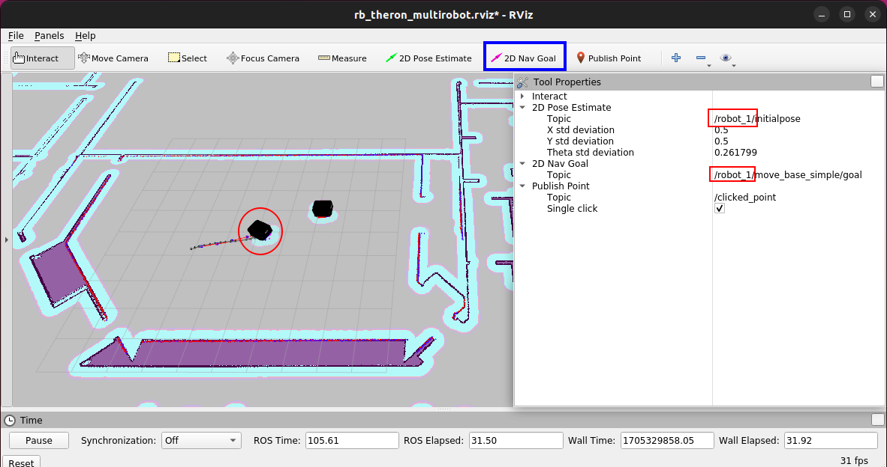
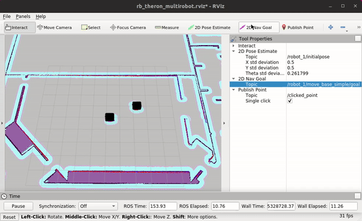
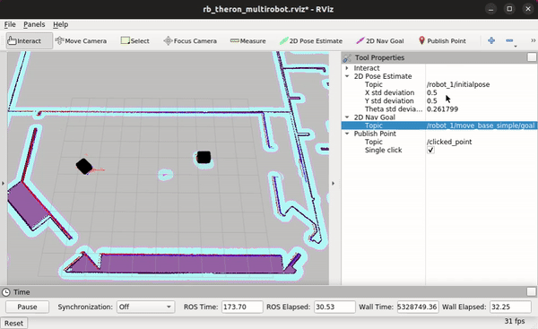
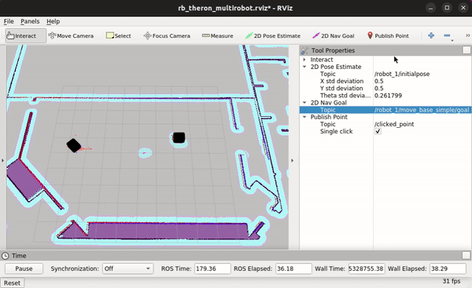

# RB-THERON simulation package

Packages for the simulation of the RB-THERON

- [Packages](#packages)
  - [rb\_theron\_gazebo](#rb_theron_gazebo)
  - [rb\_theron\_sim\_bringup](#rb_theron_sim_bringup)
- [Simulating RB-THERON](#simulating-rb-theron)
  - [Install dependencies](#install-dependencies)
  - [Workspace and repository](#workspace-and-repository)
  - [Compile:](#compile)
  - [Launch RB-THERON simulation](#launch-rb-theron-simulation)
  - [Environment Variables](#environment-variables)
- [Docker](#docker)
  - [System Installation](#system-installation)
  - [Simulation installation](#simulation-installation)
  - [Usage](#usage)
  - [Docker Environment
    Variables](#docker-environment-variables)
  - [Additional information](#additional-information)
  - [Known bugs](#known-bugs)

## Packages

### rb_theron_gazebo

Launch files and world files to start the models in gazebo

### rb_theron_sim_bringup

Launch files that launch the complete simulation of the robot

## Simulating RB-THERON

This are the steps to run the simulation in ros environment. 
It's assumed that already have installed the following on your system:

- [ROS](http://wiki.ros.org/ROS/Installation)
- [catkin-tools](https://pypi.org/project/catkin-tools/)
- [rosdep](https://pypi.org/project/rosdep/)

### Install dependencies

This simulation has been tested using Gazebo 9 version. To facilitate the installation you can use the vcstool:

```bash
sudo apt-get install -y python3-vcstool
```

### Workspace and repository

Create the workspace and clone the repository using the following commands:

```bash
mkdir catkin_ws
cd catkin_ws
vcs import --input \
  https://raw.githubusercontent.com/RobotnikAutomation/rb_theron_sim/noetic-devel/repos/rb_theron_sim.repos.yaml
rosdep install --from-paths src --ignore-src -y -r
```

### Compile:

You will need the compile the workspace in order to make it work

```bash
catkin build
source devel/setup.bash
```

### Launch RB-THERON simulation

For default configuration with 1 robot:

```bash
roslaunch rb_theron_sim_bringup rb_theron_complete.launch
```

if you want to use more than one robot specify the number using the parameter `robot_qty` or the environment variable `ROBOT_QTY`:

```bash
roslaunch rb_theron_sim_bringup rb_theron_complete.launch robot_qty:=5
```

- RB-THERON Omni:

```bash
roslaunch rb_theron_sim_bringup rb_theron_complete.launch xacro_robot:=rb_theron_omni.urdf.xacro use_ros_planar_move_plugin:=true odom_model_type:=omni
```

or:

```bash
ROBOT_QTY=5 roslaunch rb_theron_sim_bringup rb_theron_complete.launch
```

### Environment Variables

#### Robot quantity and namespace parameters

| Environment | Default Value | Meaning                               |
| ----------- | ------------- | ------------------------------------- |
| `ROBOT_QTY` | `1`           | Number of robots to spawn (maximum 5) |
| `ROBOT_ID`  | `robot`       | Robot namespace                       |

#### Single robot or robot 1 init pose parameters

| Environment   | Default Value | Meaning                                                    |
| ------------- | ------------- | ---------------------------------------------------------- |
| `X_INIT_POSE` | `0.0`         | robot or robot_1 (in case of multiple robot) x init pose   |
| `Y_INIT_POSE` | `0.0`         | robot or robot_1 (in case of multiple robot) y init pose   |
| `Z_INIT_POSE` | `0.0`         | robot or robot_1 (in case of multiple robot) z init pose   |
| `INIT_YAW`    | `0.0`         | robot or robot_1 (in case of multiple robot) yaw init pose |

#### Robot 2 init pose parameters

| Environment      | Default Value | Meaning               |
| ---------------- | ------------- | --------------------- |
| `R2_X_INIT_POSE` | `2.0`         | robot_2 x init pose   |
| `R2_Y_INIT_POSE` | `1.0`         | robot_2 y init pose   |
| `R2_Z_INIT_POSE` | `0.00`        | robot_2 z init pose   |
| `R2_INIT_YAW`    | `0.0`         | robot_2 yaw init pose |

#### Robot 3 init pose parameters

| Environment      | Default Value | Meaning               |
| ---------------- | ------------- | --------------------- |
| `R3_X_INIT_POSE` | `-2.0`        | robot_3 x init pose   |
| `R3_Y_INIT_POSE` | `-1.0`        | robot_3 y init pose   |
| `R3_Z_INIT_POSE` | `0.00`        | robot_3 z init pose   |
| `R3_INIT_YAW`    | `0.0`         | robot_3 yaw init pose |

#### Robot 4 init pose parameters

| Environment      | Default Value | Meaning               |
| ---------------- | ------------- | --------------------- |
| `R4_X_INIT_POSE` | `-2.0`        | robot_4 x init pose   |
| `R4_Y_INIT_POSE` | `1.0`         | robot_4 y init pose   |
| `R4_Z_INIT_POSE` | `0.00`        | robot_4 z init pose   |
| `R4_INIT_YAW`    | `0.0`         | robot_4 yaw init pose |

#### Robot 5 init pose parameters

| Environment      | Default Value | Meaning               |
| ---------------- | ------------- | --------------------- |
| `R5_X_INIT_POSE` | `2.0`         | robot_5 x init pose   |
| `R5_Y_INIT_POSE` | `-1.0`        | robot_5 y init pose   |
| `R5_Z_INIT_POSE` | `0.00`        | robot_5 z init pose   |
| `R5_INIT_YAW`    | `0.0`         | robot_5 yaw init pose |

#### Launch flags

| Environment               | Default Value | Meaning                                  |
| ------------------------- | ------------- | ---------------------------------------- |
| `LAUNCH_GMAPPING`         | `false`       | launching gmapping                       |
| `LAUNCH_AMCL`             | `true`        | launching amcl                           |
| `LAUNCH_MAPSERVER`        | `true`        | launching mapserver                      |
| `LAUNCH_MOVE_BASE`        | `true`        | launching move base                      |
| `LAUNCH_PAD`              | `true`        | launching pad (disabled for multirobots) |
| `LAUNCH_RVIZ`             | `true`        | launching rviz                           |
| `LAUNCH_LASER_MERGER`     | `false`       | launching laser_merger                   |
| `LAUNCH_WEB_BACKEND`      | `false`       | launching web backend                    |
| `LAUNCH_POSE_PUBLISHER`   | `false`       | launching pose publisher                 |
| `LAUNCH_WEB_THROTTLE`     | `false`       | launching web throttle                   |
| `LAUNCH_ROSBRIDGE`        | `true`        | launching rosbridge                      |
| `LAUNCH_WEB_PAD`          | `true`        | launching web pad                        |
| `LAUNCH_WEB_VIDEO_SERVER` | `true`        | launching web video server               |
| `USE_GPU`                 | `true`        | gazebo use gpu                           |

#### Gazebo parameters

| Environment | Default Value | Meaning            |
| ----------- | ------------- | ------------------ |
| `VERBOSE`   | `false`       | gazebo verbose     |
| `GUI`       | `false`       | gazebo gui launch  |
| `DEBUG`     | `false`       | gazebo debug       |
| `USE_GPU`   | `true`        | gazebo gpu plugins |

#### Pose republisher parameters

| Environment                        | Default Value    | Meaning                      |
| ---------------------------------- | ---------------- | ---------------------------- |
| `POSE_PUBLISHER_FREQUENCY`         | `10`             | pose publisher frequency     |
| `POSE_PUBLISHER_BASE_FRAME_SUFFIX` | `base_footprint` | robot base frame suffix      |
| `POSE_PUBLISHER_TOPIC_REPUB`       | `pose`           | robot pose republished topic |

#### Rosbridge parameters

| Environment      | Default Value | Meaning |
| ---------------- | ------------- | ------- |
| `ROSBRIDGE_PORT` | `9090`        | default |

#### Web Throttle parameters

| Environment               | Default Value    | Meaning                     |
| ------------------------- | ---------------- | --------------------------- |
| `THROTTLE_MAP`            | `false`          | Throttle map                |
| `ROBOT_GPS_MODEL`         | `none`           | gps model to                |
| `ROBOT_HMI_2D_SENSOR_1`   | `none`           | 2d laser scan 1 to throttle |
| `ROBOT_HMI_2D_SENSOR_2`   | `none`           | 2d laser scan 2 to throttle |
| `ROBOT_HMI_2D_SENSOR_3`   | `none`           | 2d laser scan 3 to throttle |
| `ROBOT_HMI_3D_SENSOR_1`   | `none`           | 3d laser scan 1 to throttle |
| `ROBOT_HMI_3D_SENSOR_2`   | `none`           | 3d laser scan 2 to throttle |
| `ROBOT_HMI_3D_SENSOR_3`   | `none`           | 3d laser scan 3 to throttle |
| `ROBOT_HMI_MAP_NAV_TOPIC` | `navigation_map` | navigation map throttle     |
| `ROBOT_HMI_MAP_TOPIC`     | `map`            | map to throttle             |

#### Robot web joystick parameters

| Environment               | Default Value        | Meaning                                 |
| ------------------------- | -------------------- | --------------------------------------- |
| `ROBOT_WEB_PAD_PLUGIN`    | `web_pad`            | web pad configuration file              |
| `ROBOT_WEB_PAD_TOPIC`     | `web_joy`            | web pad joy topic                       |
| `ROBOT_WEB_PAD_TWISTMUX`  | `web_teleop/cmd_vel` | topic to publish cmd_vel                |
| `ROBOT_WEB_VIDEO_QUALITY` | `50`                 | quality of transmission of video server |

#### Robot web video server parameters

| Environment                      | Default Value | Meaning                          |
| -------------------------------- | ------------- | -------------------------------- |
| `ROBOT_WEB_VIDEO_SERVER_ADDRESS` | `0.0.0.0`     | allowed IPs for web video server |
| `ROBOT_WEB_VIDEO_SERVER_PORT`    | `8092`        | port for web video server        |
| `ROBOT_WEB_VIDEO_TRANSPORT`      | `compressed`  | type of video transport          |

## Docker

The simulation requires a graphical user interface (GUI). If you have an nvidia powered machine, you can use the nvidia-containers to use graphical acceleration and improve performance.

### System Installation

#### Intel GPU

- [docker engine](https://docs.docker.com/engine/install/ubuntu/)
- [docker compose plugin](https://docs.docker.com/compose/install/linux/)

#### Nvidia GPU

- [docker engine](https://docs.docker.com/engine/install/ubuntu/)
- [docker compose plugin](https://docs.docker.com/compose/install/linux/)
- nvidia-drivers
- [nvidia-docker](https://docs.nvidia.com/datacenter/cloud-native/container-toolkit/install-guide.html#docker)

### Simulation installation

Before using the RB-THERON simulation with Docker it is necessary to download the repository.

```bash
git clone git@github.com:RobotnikIstobalAI2/rb_theron_sim.git
```

**NOTE:** please note that all changes made in the RB-THERON repository will not be updated in your local repository. To make sure that your cloned RB-THERON repository is updated use the following commands:

```bash
cd rb_theron_sim
git checkout noetic-devel
git pull
cd ..
```

#### Build image

If you have not yet built the RB-THERON image or want to make sure that all changes in the RB-THERON files are updated in the image, you have to build the appropriate RB-THERON image.

You can build the image without launching the simulation by using the following commands:

```bash
cd rb_theron_sim
git checkout noetic-devel
cd container/builder
docker compose build
cd ../../..
```

**NOTE:** keep in mind that all changes on the RB-THERON files, will not be updated to image if you do not rebuild image. On the other hand, instead of using the command `docker compose build` you can run the command `docker compose build --no-cache` to build (or rebuild) the image without using the cache data.

### Usage

The RB-THERON simulation can be launched through a native graphical user interface (using CPU or GPU) or via web.

#### Native GUI simulation

```bash
cd rb_theron_sim
git checkout noetic-devel
cd container
nvidia-container-cli info  &>/dev/null \
&& cd gui-gpu-nvidia \
|| cd gui-cpu-only
docker compose up -d
```

#### Web simulation

```bash
cd rb_theron_sim
git checkout noetic-devel
cd container/web-cpu-only
docker compose up -d
```

To access the web interfaces use the following links on your browser:

- **Rviz**: [http://localhost:7080](http://localhost:7080)
- **Gazebo**: [http://localhost:7082](http://localhost:7082)

### Docker Environment Variables

Given the three distinct configurations available for launching the RB-THERON simulation with Docker ([gui-cpu-only](./container/gui-cpu-only/compose.yaml), [gui-gpu-nvidia](./container/gui-gpu-nvidia/compose.yaml) and [web-cpu-only](./container/web-cpu-only/compose.yaml)), a structured approach has been implemented to prevent redundancy of environment variables within the YAML files of these configurations. This is achieved through the utilization of features such as `include` and `merge` to consolidate various files within the same YAML.

To facilitate this process, the [environment](./container/environment) folder has been established. Within this directory, four additional subfolders have been created, each containing the essential environment variables required for all Docker Compose files. The subfolders of [environment](./container/environment) are as follows:
- [compose](./container/environment/compose): This directory includes all the files with the environment variables needed for the YAMLs of the [gui-cpu-only](./container/gui-cpu-only/compose.yaml), [gui-gpu-nvidia](./container/gui-gpu-nvidia/compose.yaml) and [web-cpu-only](./container/web-cpu-only/compose.yaml) compose files.
- [gui](./container/environment/gui): This folder contains all the files with the environment variables required for the docker of the compose files that utilizes graphical user interface (GUI). This directory includes the pertinent ROS materials and components necessary for GUI functionality.
- [simulation](./container/environment/simulation): This directory includes all the files with the environment variables for the docker of the compose files that use the Gazebo simulation. Consequently, this directory includes the relevant ROS materials.
- [web](./container/environment/web): This folder includes all the files with the environment variables employed for the docker of the compose files that run Rviz and Gazebo via the web interface. So, this directory includes the necessary ROS materials and components for web interface functionality.

The main subfolder is the [compose](./container/environment/compose) directory. The following are the files and environment variables contained within this directory:

#### Builder configuration ([builder-config.env](./container/environment/compose/builder-config.env))

| Environment          | Default Value            | Meaning                                                       |
| -------------------- | ------------------------ | ------------------------------------------------------------- |
| `IMAGE_BASE_VERSION` | `0.5.0`                  | Image base version for building the container                 |
| `IMAGE_NAME`         | `robotnik-simulations`   | Image name for building the container                         |
| `REGISTRY_PROJECT`   | `robotnik`               | Registry proyect for building the container                   |
| `BUILDER_TYPE`       | `local`                  | Override or not git simulation code with local changes        |
| `ROS_MIRROR`         | `ros.mirror.robotnik.ws` | ROS apt mirror to use in order to increase the download speed |

**NOTE:** the environment `BUILDER_TYPE` could have the following values:

| Value   | Meaning                                                     |
| ------- | ----------------------------------------------------------- |
| `base`  | use the simulation repository obtained in git from vcs file |
| `local` | override simulation with local changes                      |

#### Registry base ([registry-docker-hub.env](./container/environment/compose/registry-docker-hub.env) or [registry-robotnik.env](./container/environment/compose/registry-robotnik.env))

`REGISTRY_BASE` is the variable to your private registry, which allows to download the images (if they are present on this registry) without the need of building them locally. By default is blank, which means that it is disabled.

- [registry-docker-hub.env](./container/environment/compose/registry-docker-hub.env): This file utilizes the Docker Hub registry, thereby disabling the private registry (hence the default blank value). It serves as the default configuration in the Docker Compose files.

| Environment     | Default Value | Meaning            |
| --------------- | ------------- | ------------------ |
| `REGISTRY_BASE` | `""`          | Registry base name |

- [registry-robotnik.env](./container/environment/compose/registry-robotnik.env): This file uses the Robotnik private registry.

| Environment     | Default Value             | Meaning            |
| --------------- | ------------------------- | ------------------ |
| `REGISTRY_BASE` | `"registry.robotnik.ws/"` | Registry base name |

**NOTE:** If you employ the `REGISTRY_BASE` variable to your private registry, ensure that you add a final `/` in order to work, for example, `registry.robotnik.ws/`.

#### Builder version ([version.env](./container/environment/compose/version.env))

| Environment         | Default Value | Meaning                            |
| ------------------- | ------------- | ---------------------------------- |
| `DOCKER_ROS_DISTRO` | `noetic`      | ROS distribution                   |
| `VERSION`           | `devel`       | Repository version (branch or tag) |

#### Ports used in the web docker compose file ([web-ports.env](./container/environment/compose/web-ports.env))

| Environment        | Default Value | Meaning                             |
| ------------------ | ------------- | ----------------------------------- |
| `FILEBROWSER_PORT` | `7081`        | Port of the file server browser     |
| `WS_RVIZ_PORT`     | `7083`        | Port of the Rviz websocket          |
| `NGINX_RVIZ_PORT`  | `7080`        | Port of the Rviz webserver          |
| `WS_GZ_PORT`       | `7085`        | Port of the Gazebo client websocket |
| `NGINX_GZ_PORT`    | `7082`        | Port of the Gazebo client webserver |

#### Image versions used in the web docker compose file ([web-versions.env](./container/environment/compose/web-versions.env))

| Environment           | Default Value           | Meaning                                    |
| --------------------- | ----------------------- | ------------------------------------------ |
| `NOVNC_VERSION`       | `web-1.3.0-2-rc02`      | Image base version for web files           |
| `FILEBROWSER_VERSION` | `2.24.2-1`              | Image base version for file server browser |
| `WEBSOCKIFY_VERSION`  | `backend-0.11.0-1`      | Image base version for Rviz websocket      |
| `NGINX_VERSION`       | `1.25.3-alpine3.18`     | Image base version for Rviz webserver      |
| `PHP_VERSION`         | `8.0.30-fpm-alpine3.16` | Image base version for Rviz PHP server     |

### Additional information

#### Verify the environment variables used by the Docker simulation

To check all the environment variables employed by the Docker RB-THERON simulation and their corresponding values, execute the following command in a terminal within the same directory as the `compose.yaml` file:

```bash
docker compose config
```

#### Finalize the Docker simulation

To stop the Docker RB-THERON simulation use in a terminal in the same folder as the `compose.yaml` the following command:

```bash
docker compose down
```

#### Enter on the container

If you want to enter on the container, first open another terminal and then you have 2 options:

1. Use the `docker` command with the following structure `docker exec -it rb-theron-sim-<container-name> bash`. For example:
   
   ```bash
   docker exec -it rb-theron-sim-rviz-1 bash
   ```
   
   **Note**: Use the double tab key (`[TAB][TAB]`) if you need help to auto-complete the name of the container.

2. Use the `docker compose` command with the following structure `docker compose exec <container-name> bash`, for example:
   
   ```bash
   docker compose exec rviz bash
   ```

  **Note**: Use the double tab key (`[TAB][TAB]`) if you need help to auto-complete the name of the container.

**NOTE:** in both cases, to exit from the container run in the terminal the following command:

```bash
exit
```

#### Other comments

- This docker requires a graphical user interface

- The `ROS_MASTER_URI` is accessible outside the container, so in the host any ros command should work

- You could also run a `roscore` previous to launch the simulation in order to have some processes on the host running

### Known bugs

#### Can't change RVIZ  2D Nav goal topic

In Rviz you can normally move the robots using the "2D Nav Goal" button. The robot that will be moved will be the one with its id is in the respective topics, as you can see in the following image.

<p align="center">
  
</p>

In the following video it is shown how to move the robot with id `robot_1`:

<p align="center">
  
</p>

To move another robot it is usually as simple as replacing the id of the respective topics with the appropriate robot id (e.g., `robot_2`).
However, it has been observed that in this simulation there is sometimes a bug which does not allow the topics to be modified, as can be seen in the following video.

<p align="center">
  
</p>

##### Workaround

To solve this bug, click on "Tool Properties" and you will be able to modify the topics by replacing the `robot_1` id with `robot_2`.
Then, if the "2D Nav Goal" button is used, the robot with id `robot_2` will move, as can be seen in the following video.

<p align="center">
  
</p>